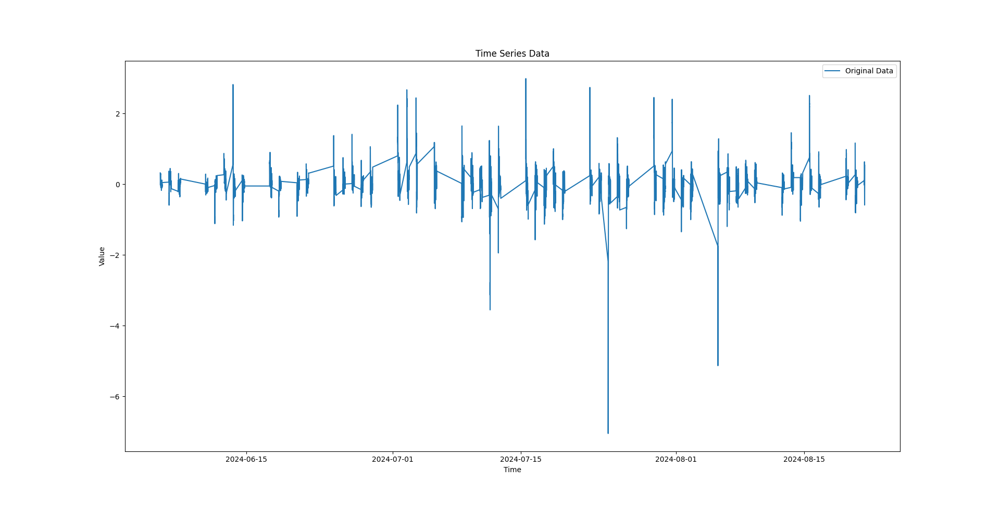
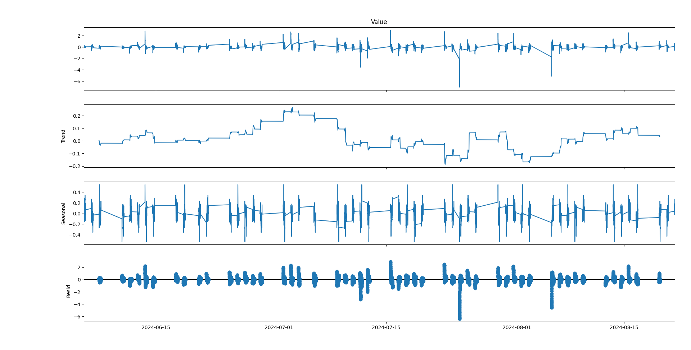
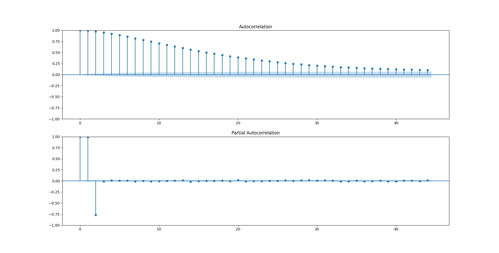

# Time Series Analysis and Forecasting with SARIMAX

## Overview

This provides a detailed explanation of the analysis performed on a financial time series dataset. The dataset contains minute-level data, and the goal was to identify patterns such as trends, seasonality, and noise, and to build a SARIMAX model for forecasting.

## Table of Contents

1. [Dataset Description](#dataset-description)
2. [Analysis Summary](#analysis-summary)
   - [ADF Test](#adf-test)
   - [Decomposition](#decomposition)
   - [ACF Plot](#acf-plot)
   - [PACF Plot](#pacf-plot)
3. [SARIMAX Model Development](#sarimax-model-development)
   - [Model Parameters](#model-parameters)
   - [Model Fitting and Validation](#model-fitting-and-validation)
4. [Conclusion](#conclusion)

## Dataset Description

The dataset consists of minute-level financial data with the following columns:
- **Time**: Unix timestamp representing the date and time.
- **Value**: The financial value recorded at each minute.



## Analysis Summary

### ADF Test

- **ADF Statistic**: -22.52
- **p-value**: 0.0

**Conclusion**: The series is stationary, which means that no differencing is needed (`d=0` in the ARIMA model).

### Decomposition

1) Trend Component
- The trend component shows fluctuations without a clear direction, indicating the absence of a strong long-term trend in the data.

2) Seasonal Component
- The seasonal component reveals a repeating daily pattern, indicating strong seasonality in the data. This justifies the inclusion of seasonal parameters in the SARIMAX model.

3) Residuals Component
- The residuals show some clustering and spikes, suggesting that while much of the data structure has been captured, some noise or volatility remains. This needs to be evaluated further after model fitting.

### ACF/PACF Plot


1) ACF Plot
- The ACF plot shows a slow, gradual decay, indicating a significant autoregressive component in the data. This suggests the need for an AR term in the SARIMAX model.

2) PACF Plot
- The PACF plot shows a sharp cut-off after lag 1, indicating that an AR(1) process is sufficient to capture the autoregressive nature of the series.

## SARIMAX Model Development

### Model Parameters

Based on the analysis, the following SARIMAX model parameters were selected:

```python
SARIMAX(series,
        order=(1, 0, 1),  # ARIMA parameters (p, d, q)
        seasonal_order=(1, 0, 1, 1440),  # Seasonal parameters (P, D, Q, s)
        exog=None)  # No exogenous variables used in this analysis
```

- **ARIMA Order (`p, d, q`)**:
  - `p=1`: Selected based on the PACF plot.
  - `d=0`: No differencing needed (confirmed by the ADF test).
  - `q=1`: Selected based on the ACF plot.

- **Seasonal Order (`P, D, Q, s`)**:
  - `P=1`: Seasonal AR term to capture daily seasonality.
  - `D=0`: No seasonal differencing needed.
  - `Q=1`: Seasonal MA term to capture residual seasonal autocorrelation.
  - `s=1440`: Reflects daily seasonality in minute-level data.

### Model Fitting and Validation

After fitting the SARIMAX model with the selected parameters, the residuals were analyzed to ensure they behaved like white noise, indicating that the model captured the series' dynamics effectively.

- **Residual Diagnostics**: Post-model fitting, the residuals were checked to ensure no significant autocorrelation remained, validating the model's effectiveness.

- **Model Validation**: Cross-validation or out-of-sample testing was recommended to ensure the model generalizes well to unseen data.

## Conclusion

The time series data was successfully analyzed and modeled using SARIMAX, with careful consideration given to trend, seasonality, and noise. The selected model parameters (`p=1, d=0, q=1, P=1, D=0, Q=1, s=1440`) are based on a thorough analysis using the ADF test, ACF/PACF plots, and seasonal decomposition. This model is expected to provide robust forecasts for the financial time series data, with the next steps involving validation and further fine-tuning based on residual analysis.

You can see the detailed analysis [here](result/analysis_for_SARIMAX.pdf).
